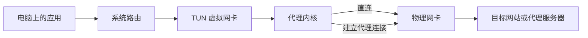
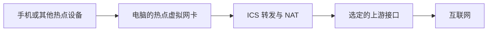
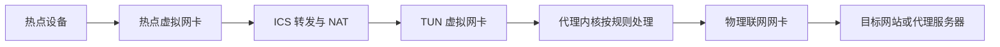

---
tags:
  - 网络
  - 代理
  - Windows
  - 故障排查
draft: true
---

这次遇到的问题是：Windows 上使用代理软件的 TUN 模式时，开启移动热点后，热点设备无法通过 DHCP 获取地址，电脑本机也无法正常上网。**最终有效的操作是手动修改 ICS，将共享来源切换为 TUN 虚拟网卡，内部连接仍指向热点虚拟网卡。**

## 当时的现象与解决方法

原始讨论记录了以下现象：

- 开启 TUN 后再开热点，热点设备无法正常获取 IP 地址。
- 本机也无法上网。当时怀疑直接使用 IP 连接可能可用，但没有确认，所以不能把这次问题直接归为 DNS 故障。
- 手动设置 ICS 时，Windows 提示已经存在共享。
- 将共享来源指定为 TUN 网卡后，反馈为“就正常了”。

这些是我在[与 Gemini 的讨论记录](https://aistudio.google.com/app/prompts/1KxRgFm5x5Av5OgW5V4SO5lz4CInWAZfk)中提供的实际观察。记录没有给出系统版本、代理内核版本、路由表或抓包结果。

具体操作如下：

1. 开启代理软件的 TUN 模式和 Windows 移动热点，使两张虚拟网卡都存在。
2. 按 `Win + R`，输入 `ncpa.cpl`，打开“网络连接”。
3. 找到代理软件创建的 **TUN 虚拟网卡**，打开“属性 → 共享”。网卡名称随客户端而异，不能只凭名称里有“虚拟”二字判断。
4. 勾选“允许其他网络用户通过此计算机的 Internet 连接来连接”。
5. 在“家庭网络连接”中选择 **热点的虚拟网卡**。它可能显示为“本地连接\* 数字”，可结合网卡描述和热点开关前后的变化确认。
6. 如果提示已有其他连接启用共享，核对后将共享源切换到 TUN 网卡。这里是替换原来的共享源，而不是再并列增加一个。
7. 让热点设备重新连接，检查能否自动获取 IP、网关和 DNS，并分别测试电脑与下游设备的联网情况。

设置关系是：**在 TUN 网卡上启用共享，将网络共享给热点网卡**。不要反过来配置成“把物理网卡共享给 TUN 网卡”。

> [!success] 本次验证结果
> 切换 ICS 共享源后，网络恢复正常。这是本次已经验证有效的处理方法；没有证据表明还需要同时关闭严格路由、手动指定 IP 或修改 DNS。

## 为什么会提示“已有共享”

开启热点后，系统中已经存在一组 ICS 共享关系。ICS 同一时间只能选择一个公共连接作为共享源，因此在另一张网卡上启用共享时，会涉及原有共享源的替换。[Microsoft：Shared Connections](https://learn.microsoft.com/en-us/previous-versions/windows/desktop/ics/shared-connections)

结合本次操作，切换前存在的共享绑定没有使热点与 TUN 正常协同；把 TUN 设为共享源后，重新建立的共享关系恢复了联网。旧共享源很可能是移动热点设置中选定的物理联网接口，但记录中没有保留它的名称，“已有共享”的提示本身也不能证明具体是哪张网卡。

## 先理清 TUN 和 ICS 各自做了什么

TUN 是一个处理 IP 数据包的虚拟网络接口。代理软件启用 TUN 后，通常会创建虚拟网卡，再配合路由规则，把需要接管的流量送入代理内核。具体实现不一定是直接把原来的默认网关改成 TUN，也可能添加覆盖更具体地址范围的路由。

流量进入内核后，才按规则决定直连、代理或拒绝。**TUN 本身不负责加密**，是否加密取决于所用代理协议；即使关闭代理，HTTPS 自身也有 TLS 加密。



上图是被 TUN 接管的流量路径。内核向代理服务器发起的连接还需要通过实际联网的接口发出去，不能再次无限进入自己的 TUN。

Windows 则通过 ICS（Internet Connection Sharing，Internet 连接共享）提供共享网络所需的 NAT、地址分配和名称解析服务。热点设备拿到地址后，把跨网段的数据交给电脑，由电脑转发到外部网络。这里的电脑同时承担了网关的角色。[Microsoft：ICS 服务说明](https://learn.microsoft.com/en-us/troubleshoot/windows-server/networking/set-up-internet-connection-sharing)

ICS 要区分两个方向：连接外网的共享源，以及连接下游设备的内部接口。共享物理网络时，可以简化为以下路径；这里的“公共／内部”描述共享方向，不是 Windows 防火墙的网络配置文件分类。[Microsoft：Shared Connections](https://learn.microsoft.com/en-us/previous-versions/windows/desktop/ics/shared-connections)



移动热点设置中的“共享我的 Internet 连接来源”决定要共享哪条连接，不能只凭“热点已开启”判断共享源。[Microsoft：移动热点设置](https://support.microsoft.com/en-us/windows/experience/connectivity-networking/use-your-windows-device-as-a-mobile-hotspot)

**电脑自己的流量能进入 TUN，不代表热点设备经 ICS 转发的流量也会走同一条路径。** 上面两张图不能不加条件地拼在一起。

## 切换为 TUN 共享后，流量怎样走

将 TUN 设为 ICS 共享源后，下游发起连接的逻辑路径可以表示为：



这张图描述的是共享成功时的逻辑转发关系，不是对本次故障抓包得到的逐包还原。关键变化是让热点的共享上游接入代理内核处理流量的路径；物理网卡仍然承担最终的网络传输。

这里需要修正原讨论中的一个解释：**共享物理网卡，并不意味着手机会收到代理的加密隧道数据、因为无法解密而断网。** ICS 做的是 IP 转发与 NAT，不会把电脑上代理进程的连接任意交给手机。代理协议的封装与解封装由代理内核及对应服务器处理，TUN 也不是一个“只剩解密后互联网”的网卡。

DHCP 则发生在热点设备与电脑的热点侧之间，不需要先访问代理服务器才能分配地址。切换共享源会重新配置共享关系，可能同时恢复内部接口上的服务状态。因此，恢复结果支持“重设 ICS 共享关系是有效修复”，却不足以证明先前一定是 TUN 拦截了 DHCP，或发生了底层驱动冲突。本机断网的具体原因也仍缺少 DNS、路由和过滤规则的前后对照。

## 如果重设共享后仍异常，还可以检查什么

以下是扩展排查方向，不是本次已经确认的故障原因。涉及配置的示例以 Mihomo 为例，其他内核需查对应文档。

### 1. 出口选择或共享绑定发生变化

热点开启后，系统多了一个网络接口，也启用了共享服务。如果代理内核自动选择了不合适的出站接口，或者 ICS 的共享源与预期不符，就可能出现连接超时。

这里需要分别核对：ICS 把下游流量交给谁，以及代理内核最终从哪张网卡连接外网。前者影响热点共享，后者也可能让电脑自身断网。Mihomo 提供自动出口检测和手动指定出口的选项，多网卡环境应核对实际选择。[Mihomo：TUN 出口检测](https://wiki.metacubex.one/config/inbound/tun/#auto-detect-interface)

同样，热点网段如果与上游网络或其他虚拟网络重叠，也可能导致数据走错接口。网段是否冲突要看实际 IP 和掩码，不能只看网卡名称。

### 2. DNS 请求没有沿着预期路径走

“网页打不开”不一定是所有网络连接都断了，也可能只是域名解析失败。

热点设备通常先向分配到的 DNS 服务器查询，电脑本机则有自己的 DNS 配置。两者不一定进入相同的解析链路。例如，下游向热点网关查询 DNS，网关再向上游查询，这与电脑应用直接发出查询的路径就有区别。

Mihomo 文档指出，Windows 下不能自动劫持发往局域网的 DNS 请求。因此，配置了 `dns-hijack` 也不能直接推导出所有热点 DNS 请求都被接管。[Mihomo：DNS 劫持](https://wiki.metacubex.one/config/inbound/tun/#dns-hijack)

### 3. 严格路由与防火墙规则影响了通信

Mihomo 的 `strict-route` 在 Windows 上会添加用于防止多网卡 DNS 泄漏的防火墙规则。它可能影响部分网络场景，但仅凭“开热点就断网”，还不能认定是这个选项导致的。[Mihomo：严格路由](https://wiki.metacubex.one/config/inbound/tun/#strict-route)

可以在保留其他配置的情况下临时关闭它做对照。如果恢复了，需要进一步确认是哪些 DNS 请求受到影响，再决定如何调整；关闭它也会放宽原有的 DNS 防泄漏约束。

另外，代理内核的防火墙放行规则是否覆盖当前网络、热点设备能否访问需要的端口，也应单独检查。

## 按什么顺序排查

### 第一步：确认到底是谁断网

用同一组网站分别测试电脑和热点设备，记录以下状态。测试手机时暂时关闭移动数据，避免手机自动切回蜂窝网络，让结果失真。

| 状态               | 电脑 | 热点设备 | 用途                           |
| ------------------ | ---- | -------- | ------------------------------ |
| 关闭 TUN、关闭热点 | 测试 | —        | 确认基础外网连接               |
| 关闭 TUN、开启热点 | 测试 | 测试     | 确认 ICS 单独工作是否正常      |
| 开启 TUN、关闭热点 | 测试 | —        | 确认 TUN 单独工作是否正常      |
| 开启 TUN、开启热点 | 测试 | 测试     | 确认问题是否只在两者共存时出现 |

若 TUN 和热点单独工作都正常，才重点检查它们共存时的变化。若只有下游失败，先查地址分配、共享源和下游 DNS；若电脑也失败，先查本机路由、代理出口和 DNS。

### 第二步：记录网卡、地址和路由

在电脑的 PowerShell 中，分别于故障前后执行以下只读命令，保存输出作比较：

```powershell
Get-NetAdapter -IncludeHidden |
    Format-Table ifIndex, Name, InterfaceDescription, Status

Get-NetIPConfiguration
Get-DnsClientServerAddress
route print -4
```

对照检查实际联网网卡、TUN 网卡和热点虚拟网卡的接口索引、地址与路由。不要只盯着 `0.0.0.0/0`：更具体的路由优先匹配，修改默认路由跃点数未必会改变最终路径。如果问题涉及 IPv6，还要查看 `route print -6`。

在热点设备上查看分配到的 IP、掩码、网关和 DNS。下文用 `192.168.137.1` 表示电脑的热点侧地址，**它只是示例，操作时必须换成实际地址**。

### 第三步：把 IP 连通与 DNS 解析分开测

在发生问题的设备上测试；如果下游也是 Windows，可以执行：

```powershell
# 示例目标：测试前先在正常联网状态下确认可用
Test-NetConnection 1.1.1.1 -Port 443

# 使用系统当前配置的 DNS
nslookup example.com

# 指定一个公共 DNS，比较解析路径
nslookup example.com 1.1.1.1
```

若 TCP 连接正常而系统 DNS 查询超时，应优先检查 DNS。若指定 DNS 成功、默认 DNS 失败，则重点查当前分配的 DNS 地址及其转发路径。

单个目标或端口失败不足以证明完全断网，应与正常状态的结果对照。指定公共 DNS 的请求也可能被 TUN 劫持，不能仅凭命令中写了 `1.1.1.1` 就断定请求真正到达了它。测试期间同时查看代理连接记录和 DNS 日志，才能确认内核有没有收到相关流量。

### 第四步：每次只改变一个设置

根据前面的证据，依次验证共享源、代理出站接口、`strict-route` 和相关防火墙规则。每次修改后重复同一组测试，记录结果；不要同时改 DNS、路由、协议栈，否则恢复了也很难知道原因。

## 根据需求选择处理方式

### 只需要电脑使用代理，热点正常提供网络

如果电脑应用支持系统代理或显式 HTTP/SOCKS 代理，可以先关闭 TUN，通过代理端口使用代理，同时让 ICS 共享正常的物理网络。这适合作为恢复联网和缩小问题范围的方法；不支持代理设置的应用仍需另行处理。

如果必须保留 TUN，且日志确认自动出口选错了，可以在现有 Mihomo 配置中合并以下片段：

```yaml
# 顶层字段，替换成实际联网网卡的名称
interface-name: "以太网"

tun:
  auto-detect-interface: false
```

这只用于固定代理出站接口，不会替你修复 ICS 绑定或 DNS。切换到 Wi-Fi 等其他上游后，要同步调整；也不要用片段覆盖原有完整配置。[Mihomo：出站接口](https://wiki.metacubex.one/config/general/#出站接口)

### 希望热点设备也能使用电脑上的代理

对于支持显式代理的应用，可以让下游直接连接电脑的代理端口。以热点侧地址 `192.168.137.1`、代理端口 `7890` 为例，在已有 Mihomo 配置中合并：

```yaml
mixed-port: 7890
allow-lan: true
bind-address: "192.168.137.1"
```

热点启动、对应地址存在后再加载配置，并让防火墙允许热点网段访问该端口。下游应用的代理服务器填写电脑的热点侧 IP，端口填写 `7890`；不能填 `127.0.0.1`，那代表下游设备自己。这里绑定热点侧地址，是为了限定代理监听的接口。[Mihomo：允许局域网访问](https://wiki.metacubex.one/config/general/#允许局域网)

这种方式下，应用主动把请求交给电脑的代理内核。手机 Wi-Fi 设置中的 HTTP 代理并不保证所有应用都会遵守，也不能覆盖所有 UDP 流量。`allow-lan` 只开放代理端口访问，不会自动让整台手机的流量进入 TUN。

如果希望下游无需设置代理，可以按本文开头的方法，将 TUN 适配器设为 ICS 共享源。本次通过这项操作恢复了联网；换用其他客户端或系统版本时，仍需验证转发、DNS 和回程。

这种透明共享能否工作取决于虚拟网卡、代理内核和 Windows 的配合。只有确认下游请求出现在代理日志中、实际访问和出口符合规则，才能说代理共享成功。

## 结论

本次问题通过**把 ICS 共享源切换为 TUN 网卡、共享目标设为热点网卡**解决。“已有共享”的提示意味着需要替换现有共享源。这个结果确认了有效的修复操作，但不能单凭恢复联网就认定 DHCP、DNS 或驱动层面的具体故障机制。再次遇到类似现象时，先核对共享关系，再沿着实际流量路径逐项检查。

## 笔记关联

- **相关基础**：[[杂七杂八的笔记/代理运行时序|代理运行时序]] — 先理解代理转发经过的各个参与方，再对照 TUN 接管流量与 ICS 共享的路径。
