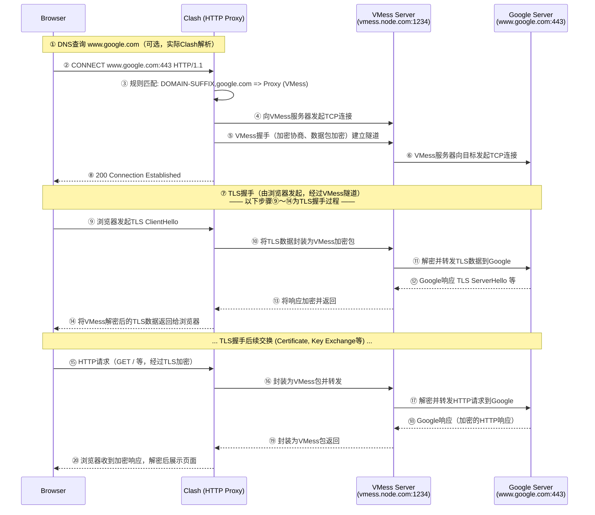

---
tags:
  - 网络
  - 代理
  - TCP
  - TLS
date: 2026-05-28
---

本质是通过海外的无封锁服务器将原始流量加密为无法被GFW识别并拦截的流量传回本机,并且绕过GFW的IP黑名单

## 笔记关联

- **延伸阅读**：[[杂七杂八的笔记/为什么开热点后TUN模式就无法上网了|为什么开热点后TUN模式就无法上网了]] — 从显式 HTTP 代理延伸到 TUN 虚拟网卡、ICS 共享与热点断网排查。
- **相关主题**：[[嵌入式学习/基于RT-Thread移植LwIP|基于RT-Thread移植LwIP]] — 对照设备侧以太网与协议栈移植，建立不同网络层次之间的联系。
